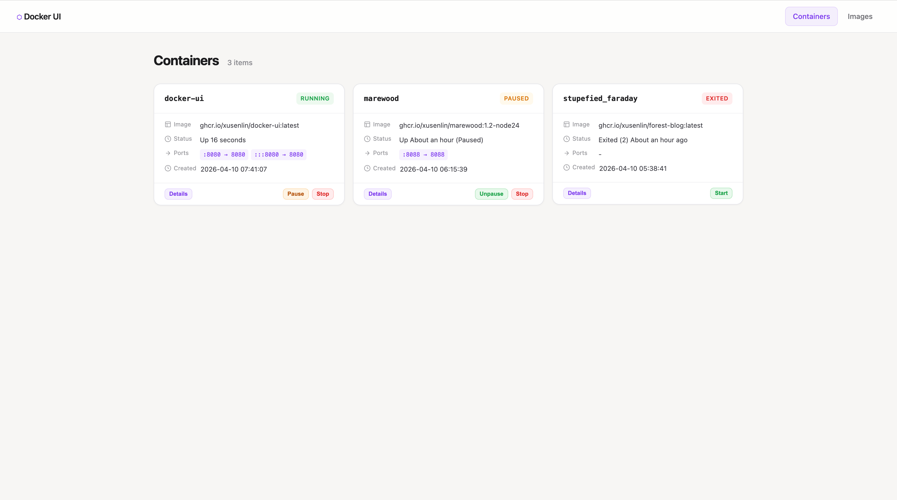
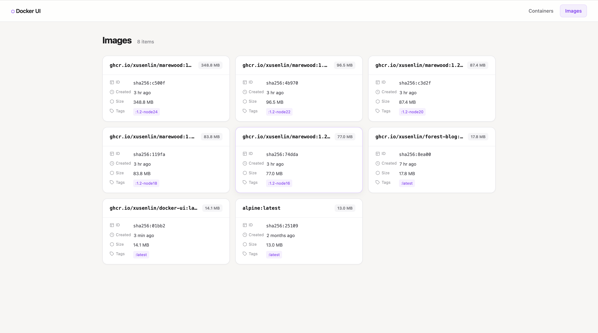

# docker-ui

一个简单的 Docker Web 管理界面，支持管理容器和镜像。

## 功能

- **容器管理**：查看列表、查看详情、启停操作
- **镜像管理**：查看本地镜像
- **认证**：简单的用户密码认证

## 截图

### 容器管理


### 镜像管理


## 快速开始

```bash
# 构建镜像
make build

# 运行容器
make run

# 访问 http://localhost:8080
```

## 配置

通过环境变量配置：

| 变量 | 默认值 | 说明 |
|------|--------|------|
| AUTH_USER | admin | 用户名 |
| AUTH_PASS | password | 密码 |
| LISTEN_ADDR | :8080 | 监听地址 |

## 技术栈

- Go (标准库 http)
- Docker API (docker.sock)
- HTML/CSS (服务端渲染)

## 项目结构

```
cmd/server/      # 程序入口
internal/
  docker/        # Docker API 封装
  handler/        # HTTP 处理器
  middleware/     # 中间件 (认证)
  model/          # 数据模型
  config/         # 配置加载
```

## 构建 Docker 镜像

```bash
make build IMG=your-registry/docker-ui:tag
make push IMG=your-registry/docker-ui:tag
```
